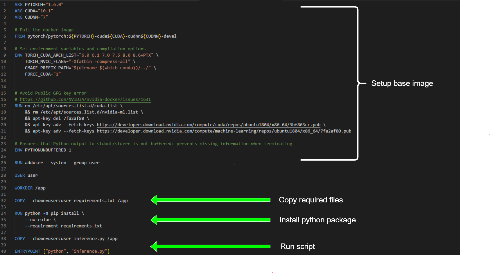

# Advanced Bio-imaging

## 1. Prerequisites <a name="prerequisites"></a>

The container is based on docker, please [install docker here](https://www.docker.com/get-started). 

## 2. An overview of the dictionary structure for this example <a name="overview"></a>

The main inference processing is executed in the file inference.py. It provides the method json_file_generate(), which creates the detections JSON file shown in the figures below.

The output struct will be generated as follows:
```
./output
├── image_1.jpg
│   └── <model_name>.json    
├── image_2.jpg
│   └── <model_name>.json    
│        ⋮
└── image_n.jpg
    └── <model_name>.json    
  
```

The output JSON file is a dictionary and will result in the following format:
```
{
    "Objects": [
        {
            "ID": 1,
            "Type": "rectangle",
            "Name": "IfF_1_T2",
            "Description": "",
            "ShowLabel": true,
            "Length": 4,
            "ObjectType": "T2",
            "Points": [
                {
                    "X": "3,3,83,83",
                    "Y": "85,5,5,85"
                }
            ],
            "Distance": null,
            "x_max": 83,
            "x_min": 3,
            "y_max": 85,
            "y_min": 5,
            "Annotation_image": "",
            "Area": ""
        },
        {
            "ID": 2,
            "Type": "rectangle",
            "Name": "IfF_2_T3",
            "Description": "",
            "ShowLabel": true,
            "Length": 4,
            "DiseaseType": "T3",
            "Points": [
                {
                    "X": "6,6,86,86",
                    "Y": "60,10,10,60"
                }
            ],
            "Distance": null,
            "x_max": 86,
            "x_min": 6,
            "y_max": 60,
            "y_min": 10,
            "Annotation_image": "",
            "Area": ""
        }
    ],
    "index_annotation_img": 2,
    "AI_ROI": []
}
```
## 3. Implementing your algorithm into a docker container image <a name="todocker"></a>
We recommend you develop and adapt this docker image example to your own detection solution. You can adapt, modify, or build the code from scratch.

If you need a different base image to build your container (e.g., Tensorflow instead of Pytorch, or another AI toolbox), if you need additional libraries and to make sure that all source files (and weights) are copied to the docker container, you will have to adapt the Dockerfile and the requirements.txt file accordingly.

Please refer to the image below (Dockerfile): image


## 4. Building your container <a name="build"></a>
To test if all dependencies are met, you should run the file build.bat (Windows) / build.sh (Linux) to build the docker container. Please note that the next step (testing the container) also runs a build, so this step is not mandatory if you are certain that everything is set up correctly.


